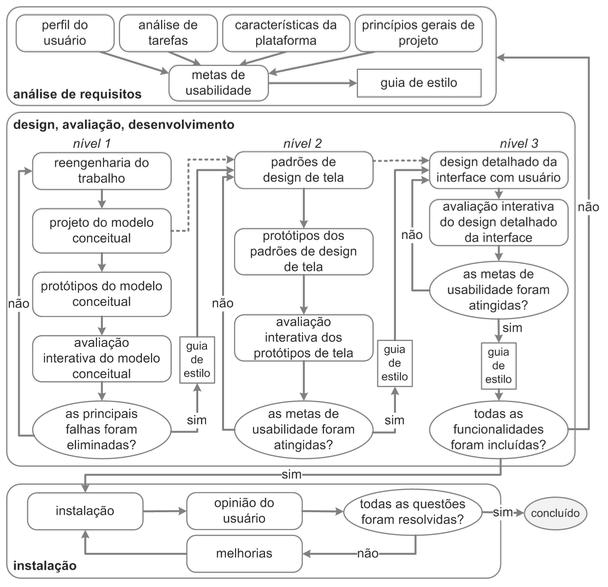

## 1. Introdução

 O design é um processo que envolve as seguintes atividades básicas:

- A análise da situação atual
- A síntese de uma intervenção
- A avaliação dessa intervenção

 Cada processo de design detalha essas atividades básicas de uma forma particular, definindo como executar cada atividade. a sequência em que elas devem ser executadas, quais atividades e por quais motivos podem se repetir e os artefatos produzidos em cada uma delas. Uma característica básica dos processos de design é a execução das atividades de forma <b>iterativa</b>, permitindo refinamentos sucessivos da análise da situação atual e da proposta de intervenção. (Barbosa e Silva, 2010).

 
 

## 2. Metodologia

A Engenharia de Usabilidade de Mayhew reune e organiza diferentes atividades propostas na área de IHC para orientar o trabalho do designer em direção a uma boa solução interativa. A figura 1 mostra as três fases desse processo interativo:

 

- **Análise de requisitos** São definidas as metas de usabilidade com base no perfil dos usuários, análise de tarefas, possibilidades e limitações da plataforma em que o sistema será executado e princípios gerais de design de IHC.

- **Design, avaliação e desenvolvimento** Tem por objetivo conceber uma solução de IHC que atenda às metas de usabilidade estabelecidas na fase anterior. Esse processo propôe projetar a solução de IHC em três níveis de detalhes. No primeiro nível, o designer precisa realizar a reengenharia do trabalho, repensando a execução das tarefas para alcançar os objetivos dos usuários, elaborar alternativas de solução do modelo conceitual, elaborar protótipos de baixa fidelidade e avaliar tais protótipos. No segundo nível, o designer deve estabelecer padrões de design de IHC para a solução sendo concebida, construir protótipos de média fidelidade de acordo com esses padrões e avaliá-los. No terceiro nível, o designer realiza o projeto detalhado da interface, com alta fidelidade, para ser implementado. Durante o desenvolvimento do sistema, a interface deve ser avaliada com a participação dos usuários.

- **Instalação** o designer deve coletar opiniões dos usuários depois de algum tempo de uso.Essas opiniões serão úteis para melhorar o sistema em versões futuras ou até mesmo para apontar a necessidade de desenvolver novos sistemas interativos ainda não previstos.

 
 

<h5 style="margin-left:25%">Figura 1: Engenharia de Usabilidade de Mayhew </h5>

 
 
 
 

## 3. Referências

1. Barbosa, S. D. J.; Silva, B. S. da; Silveira, M. S.; Gasparini, I.; Darin, T.; Barbosa, G. D. J. (2021)
   Interação Humano-Computador e Experiência do usuário. Autopublicação. ISBN: 978-65-00-19677-1.

 

## 4. Conclusão

## 5. Histórico de Versão

| Versão | Data       | Descrição                                        | Autor(es)      |
| ------ | ---------- | ------------------------------------------------ | -------------- |
| 1.0    | 07/02/2022 | Criação do documento                             | Isadora Soares |
| 1.1    | 08/02/2022 | Adicionando informações sobre processo de design | Isadora Soares |
| 1.2    | 09/02/2022 | Atualização imagem e estilo texto                | Isadora Soares |
