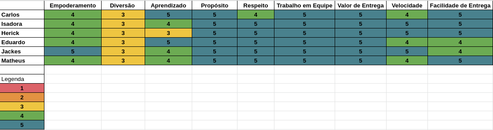

# Sprint 1

## 1. Resultados gerais

A primeira entrega trouxe bastante aprendizado à maioria da equipe, apesar de tudo, o respeito e o trabalho em equipe foram essenciais. Por conta da elaboração de vários documentos os membros não acharam tão divertido, mas acreditaram de fato; no valor do que estavam entregando, então fizeram o seu melhor nesta etapa.

## 2. Pair programming

#### Metodologia

O pair programming é um método de programação no qual duas pessoas trabalham juntas em um único programa. A primeira pessoa é o “Motorista”, que escreve o código, a outra pessoa é o “Navegador” que revisa cada linha de código conforme é digitado, verificando se há erros. Eles trocam seus papéis regularmente.

Adaptamos o método para podermos fazer entregas melhores, então dividimos a equipe em pares e trabalhamos nos artefatos com o criador do documento e a revisão. Ao decorrer da sprint esses papéis mudam.

#### Objetivo

Com o trabalho em pares as equipes devem ser capazes de :

- Constantes entregas
- Profundade de conteúdo nas entregas
- Reduz erros nos documentos
- Melhor performance por tempo de trabalho
- Aprendizado mútuo e contínuo

## 3. Health check

#### Metodologia

O Health check é uma metodologia que documenta e verifica a situação dos membros da equipe,por exemplo, como estam se sentindo com projeto, o quanto aprenderam com as entregas, satisfação com resultado e etc.

#### Objetivo

Ao fazer verificações regulares, as equipes devem ser capazes de:

- Aumentar a confiança e a segurança psicológica dentro da equipe
- Tenha um melhor relacionamento entre os colegas de equipe
- Crie uma cultura de críticas construtivas e feedback
- Levantar problemas e corrigi-los rapidamente
- Compartilhe seus sentimentos com mais facilidade e frequência

#### Resultado

## 4. Bibliografia

[Why doing Team Health Checks?](https://blog.teammood.com/2019/03/29/why-doing-team-health-checks.html?utm_source=google&utm_medium=cpc&utm_campaign=team-health-checks&utm_content=agile-health-check&utm_term=health%20check%20scrum&gclid=CjwKCAiA9tyQBhAIEiwA6tdCrFgdA7clyAjAA5cjd_9zxr1wGjiz-VAMJVyLgyZhe6F3MtEkFuBGIBoCnPQQAvD_BwE)

[O que é programação em par?](https://www.digite.com/pt-br/agile/programacao-em-pares/)

## Versionamento

| Versão | Data       | Modificação                                  | Autor                |
| ------ | ---------- | -------------------------------------------- | -------------------- |
| 1.0    | 07/02/2022 | Criação do documento                         | Carlos Rafael        |
| 1.1    | 08/02/2022 | Adicionando informações sobre o Health Check | Todos os integrantes |
